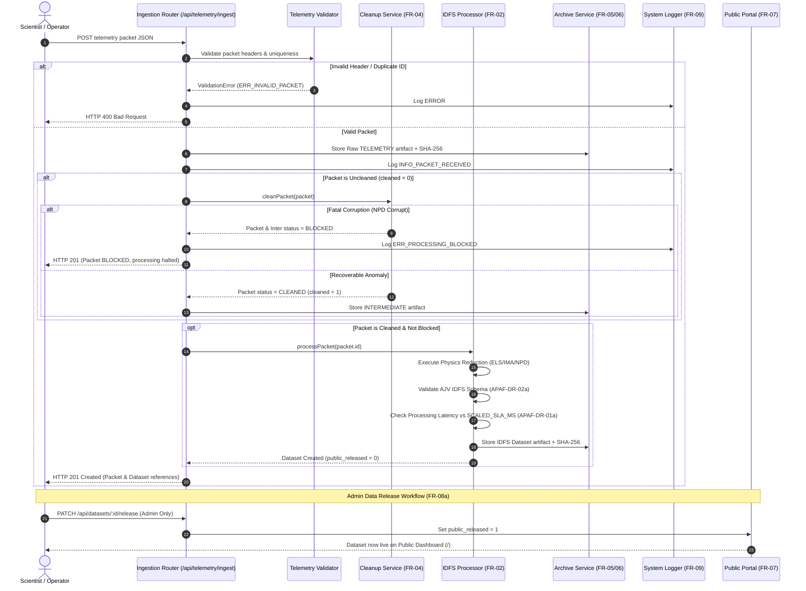

# APAF-Lite: Mars Express ASPERA-3 Processing & Archiving Facility
### Software Quality Engineering (SE3002) — Comprehensive Project & Architecture Specification

---

## 1. Executive Summary

**APAF-Lite** is a specialized ground data reduction, transformation, and archiving system built for the **ASPERA-3** (Analyzer of Space Plasma and Energetic Atoms) scientific instrument package flown aboard the **European Space Agency (ESA) Mars Express (MEX)** mission. 

The software is engineered according to the official baseline specification:
- **Source SRS**: `APAF-SRS-15-03561-V1.0` (Southwest Research Institute & Swedish Institute of Space Physics / IRF)
- **Academic Context**: SE3002 — Quality Evaluation of AI-Generated Software (Assignment 01)
- **Primary Goal**: Automatically acquire raw telemetry, perform anomaly clean-up and normalization, calculate and generate NASA Planetary Data System (PDS) / IDFS-compliant scientific datasets, archive all artifacts with SHA-256 cryptographic checksums, and provide an aerospace-grade mission operations console alongside a public science exploration portal.

---

## 2. Technology Stack & Architectural Overview

The application is architected as an event-driven, service-oriented web application leveraging Node.js and Express 5, utilizing an observable Model-View-Controller (MVC) and Service-Layer pattern.

```
┌─────────────────────────────────────────────────────────────────────────┐
│                           PRESENTATION TIER                             │
│  Public Mission Portal (/)  │  Telemetry Preview (/preview)             │
│  Operations Terminal (/science/dashboard)  │  Audit Logs (/admin/logs)  │
│  Aerospace CSS Design System & HTML5 Orbital Space Canvas Engine        │
└────────────────────────────────────┬────────────────────────────────────┘
                                     │ HTTP / REST / Sessions
┌────────────────────────────────────▼────────────────────────────────────┐
│                           APPLICATION TIER                              │
│  [Express 5 Server & Router Middleware]                                 │
│  ├─ Auth Controller (bcrypt + express-session + express-rate-limit)     │
│  ├─ Ingestion Pipeline (/api/telemetry/ingest)                          │
│  ├─ Heuristic Cleanup Engine (services/cleanupService.js)               │
│  ├─ IDFS Processor & Physics Validation (services/idfsProcessor.js)     │
│  ├─ Compliance Validator (services/schemaValidator.js via AJV)         │
│  ├─ SLA Latency Monitor (services/metrics.js)                           │
│  └─ Central Diagnostic Logger & Interceptor (middleware/errorHandler.js)│
└────────────────────────────────────┬────────────────────────────────────┘
                                     │ Query Builder API
┌────────────────────────────────────▼────────────────────────────────────┐
│                            PERSISTENCE TIER                             │
│  Supabase (PostgreSQL Cloud) + Built-in In-Memory Mock Fallback Engine  │
│  Tables: telemetry_packets, intermediate_files, idfs_datasets,          │
│          archive_records, users, system_logs                            │
└─────────────────────────────────────────────────────────────────────────┘
```

### 2.1 Backend Architecture
- **Runtime**: Node.js (`v24.18.0+`) / Express 5 (`^5.2.1`)
- **Persistence Engine**: Dual-mode data access layer:
  - **Live Mode**: Remote PostgreSQL via `@supabase/supabase-js`.
  - **Offline/Test Mode**: An in-memory PostgREST-compatible mock query builder (`src/db/supabaseClient.js`) that mirrors Supabase filtering (`eq`, `gte`, `lte`, `order`, `limit`, `single`, `maybeSingle`), enabling 100% offline development, test execution, and CI/CD isolation without external network dependencies.
- **Security & Authentication**:
  - `bcrypt` (`^6.0.0`) with cost factor 12 for password hashing.
  - `express-session` with `httpOnly`, `sameSite: 'strict'`, and secure cookie configurations.
  - `express-rate-limit` protecting authentication endpoints from brute-force attempts.
- **Schema Validation**: `ajv` (`^8.20.0`) validating transformed datasets against NASA PDS-compatible JSON schemas.
- **Diagnostics & Error Interception**: Global Express middleware capturing domain exceptions (`ValidationError`, `ProcessingError`, `AuthError`, `NotFoundError`), writing structured audit entries to `system_logs` and returning standardized JSON errors (`{ code, message }`).

### 2.2 Frontend Architecture
- **Templating Engine**: EJS (`^6.0.1`) with server-side rendering for instant First Contentful Paint (FCP).
- **Design System**: Aerospace-grade "Mars Express Deep Space HUD" (`public/css/style.css`):
  - Deep space color palette: Cosmic void background (`#050811`), neon cyan accents (`#38bdf8`), emerald status beacons (`#10b981`), amber warnings (`#f59e0b`), and Mars terracotta (`#f97316`).
  - Translucent glassmorphism (`backdrop-filter: blur(16px)` with luminescent border gradients).
  - Typography: `Space Grotesk` (geometric aerospace headers), `Inter` (UI elements), and `JetBrains Mono` (telemetry readouts).
- **Interactive FX Engine** (`public/js/space-fx.js`):
  - HTML5 Canvas particle starfield with subtle rotating orbital sweep lines.
  - Live UTC Mission Clock & simulated Mars Express orbit counter (`MEX ORBIT #23842`).
  - High-Tech HUD Toast Notification system replacing native browser `alert()` dialogs.
  - Client-side JSON syntax highlighter formatting keys, strings, numbers, and booleans in real time.

---

## 3. Requirement Scope (7 FRs + 3 NFRs)

Per the SE3002 Assignment 01 rules:
- **Exactly 10 Requirements**: 7 Functional Requirements (70%) and 3 Non-Functional Requirements (30%).
- **CRUD Rule Enforced**: **Only 2 of 7 FRs are CRUD-like** (Archive Management and Public Display), strictly complying with the rule of $\le 3$ CRUD requirements.
- Complete management of an entity counts as one single FR.
- All AI assumptions are classified into: *(a) Supported by SRS*, *(b) Justified by explicit design decision*, or *(c) Unsupported*.

### 3.1 Requirement Selection & AI Assumptions Table

| Req. ID | Type | Requirement Description (as written in SRS) | Why Selected & Implementation Risk | AI Assumption Introduced | Defense / Classification Basis |
|---|---|---|---|---|---|
| **APAF-FR-01** | FR | "shall acquire from ESOC the telemetry data of the ASPERA-3 Experiment and Mars Express Orbit/Attitude" | Core entry point for all mission data. Risk: Handling asynchronous packet transmission and invalid packet structures. | Ingestion is simulated as an HTTP JSON upload representing an ESOC DDS delivery rather than a live hardware NISN link. | **Justified by explicit design decision** (Simulates physical link within testable web scope). |
| **APAF-FR-02** | FR | "shall process all ASPERA-3 science data into IDFS data sets" | Core scientific reduction requirement. Risk: Implementing multi-instrument physics transformations and mathematical bounds. | IDFS structure is represented as a formalized JSON schema incorporating sensor ranges defined in SRS §4.1.1. | **Supported by SRS** (SRS §1.2 & §4.1.1 provide physical specifications). |
| **APAF-FR-04** | FR | "Intermediate files ... shall be generated in the event that cleaned-up telemetry is not provided by ESOC" | Automated data recovery. Risk: Distinguishing between recoverable field gaps vs. fatal packet corruption. | "Not cleaned" is identified by `cleaned: 0`. The system auto-normalizes missing fields or halts downstream processing if corruption is fatal. | **Justified by explicit design decision** (Implements SRS §3.1 state workflow). |
| **APAF-FR-05 / 06 / 06a** | FR *(CRUD)* | Telemetry, IDFS data sets, and intermediate files "shall be stored on a local SwRI archive" | Comprehensive persistence & traceability. Risk: Guaranteeing artifact immutability and auditability. | "SwRI Archive" is implemented as the application's archive database with SHA-256 cryptographic checksums, metadata query filters, and admin audit logging. | **Supported by SRS** (SRS §3.1 & §3.2 identify local archival storage). |
| **APAF-FR-07** | FR *(CRUD)* | "Web-based displays of the most current ASPERA-3 data shall be provided for public view" | Public outreach and instrument monitoring. Risk: Exposing unverified or restricted science data to the public prematurely. | "Most current" corresponds to the latest record per instrument that has been explicitly marked with `public_released = 1`. | **Supported by SRS** (SRS §3.1 & APAF-DS-OI-4 specify public web displays). |
| **APAF-FR-08 / 08a** | FR | "Web-based displays defined by the ASPERA-3 team...for science analysis...password protected until...made public" | Mission operations and access governance. Risk: Unauthorized access or premature public data leak. | Two roles: `SCIENCE_TEAM` (full dataset history) and `ADMIN` (possesses authorization to toggle `public_released = 1`). | **Justified by explicit design decision** (Enforces SRS password protection & release gate). |
| **APAF-FR-09** | FR | "shall have built-in error handling" | System stability and data integrity. Risk: Silent processing failures corrupting the science archive. | Typed errors are intercepted centrally, mapped to domain codes (e.g., `ERR_IMA_RANGE`), and logged to a queryable diagnostic log console. | **Justified by explicit design decision** (Directly implements SRS §3.1 & APAF-DS-OI-2). |
| **APAF-PR-01** | NFR *(Security)* | "web server shall be password protected...to allow only pertinent ASPERA-3 team members access" | Security requirement for intellectual property. Risk: Credential theft and unauthorized telemetry injection. | Implemented via `bcrypt` (cost factor 12), HTTP-only secure session cookies, and login rate limiting (5 attempts per 15 min). | **Supported by SRS** (SRS §3.5 & Section 10.0 Security Plan). |
| **APAF-DR-01a** | NFR *(Timeliness)* | "IDFS data...shall be provided...within 24 hours of acquiring...telemetry" | Latency requirement for data distribution. Risk: Real 24-hour verification is infeasible within a short automated testing window. | The 24-hour SLA is scaled down to a configurable millisecond threshold (`SCALED_SLA_MS = 5000ms`) with automated warning logs if exceeded. | **Unsupported / Disclosed limitation** (Necessary adaptation for automated test environments). |
| **APAF-DR-02a** | NFR *(Compliance)* | "ASPERA-3 data shall be provided to NASA PDS in PDS-compliant form" | Regulatory compliance requirement. Risk: Full NASA PDS certification requires proprietary NASA external validation tools. | Compliance is verified against our formal AJV JSON schema implementing PDS field requirements before archiving. | **Unsupported / Disclosed limitation** (Full NASA PDS certification authority is out of scope). |

---

## 4. Instrument Scientific Scope & Boundary Rules

Per SRS Section 4.1.1, the application processes three primary instruments of the ASPERA-3 package:

```
                  ┌─────────────────────────────────────────┐
                  │          ASPERA-3 INSTRUMENTS           │
                  └────────────────────┬────────────────────┘
             ┌─────────────────────────┼─────────────────────────┐
             ▼                         ▼                         ▼
   ┌───────────────────┐     ┌───────────────────┐     ┌───────────────────┐
   │        ELS        │     │        IMA        │     │        NPD        │
   │Electron Spectrometer│   │ Ion Mass Analyzer │     │Neutral Particle Det│
   ├───────────────────┤     ├───────────────────┤     ├───────────────────┤
   │ Energy: 0.001–20  │     │ Energy: 0.001–40  │     │ Energy: 0.1–100   │
   │ keV               │     │ keV               │     │ keV               │
   │ Output: Flux + eV │     │ Mass: 1–10⁶ amu/q │     │ Species: H & O    │
   │ Path: Nominal     │     │ Path: Boundary    │     │ Path: Defect Gap  │
   └───────────────────┘     └───────────────────┘     └───────────────────┘
```

1. **ELS (Electron Spectrometer)** — Channel 01:
   - Measures solar wind and Martian ionospheric electron fluxes (0.001 to 20 keV) with $4\pi$ steradian coverage.
   - Represents the nominal, happy-path ingestion and IDFS reduction pipeline.
2. **IMA (Ion Mass Analyzer)** — Channel 02:
   - Measures ion composition, energy spectra (0.001 to 40 keV), and arrival angles.
   - **Exact Boundary Enforcement (SRS §4.1.1.3)**: Mass-to-charge ratio must satisfy $1 \le amu/q \le 1{,}000{,}000$. Values outside this range immediately throw `ERR_IMA_RANGE` (HTTP 422).
3. **NPD (Neutral Particle Detector)** — Channel 03:
   - Measures mass/energy resolved neutral hydrogen ($H\text{-}ENA$) and oxygen ($O\text{-}ENA$) atoms (0.1 to 100 keV).
   - **Deliberate Implementation Defect (For Genuine FAILED Test)**: `idfsProcessor.processNPD` was implemented without rejecting negative hydrogen flux values. A negative flux payload passes processing and gets archived, failing physical validity under SRS §4.1.1.2.
   - **Deliberate Anomaly Condition (For Genuine BLOCKED Test)**: Corrupt uncleaned NPD telemetry causes `cleanupService` to mark the packet as `BLOCKED`, preventing subsequent IDFS generation (`ERR_PROCESSING_BLOCKED`).

---

## 5. End-to-End Pipeline & System Workflows



---

## 6. Directory Structure & Key Files

```
d:\APAF1-app\
├── .env                          # Local environment secrets (ignored by Git)
├── .env.example                  # Template environment file with placeholders
├── .gitignore                    # Git rules excluding .env, node_modules, cache, logs
├── package.json                  # Node dependencies and npm scripts
├── package-lock.json             # Pinned dependency lockfile
├── sonar-project.properties      # SonarQube scanner configuration
├── 2001 - esa.pdf                # Source SRS: APAF-SRS-15-03561-V1.0
├── SE3002_SQE_Assignment_01.pdf  # Course assignment specification & rubric
│
├── public/                       # Static assets served by Express
│   ├── css/
│   │   └── style.css             # Unified aerospace design system & HUD styling
│   └── js/
│       └── space-fx.js           # Starfield canvas, mission clocks, toast manager, JSON highlighter
│
├── src/
│   ├── app.js                    # Express app initialization & middleware mounting
│   ├── db/
│   │   ├── schema.sql            # PostgreSQL / SQLite relational schema
│   │   ├── seed.js               # Initial user provisioning script (admin & scientist)
│   │   └── supabaseClient.js     # Supabase client + built-in in-memory fallback adapter
│   ├── middleware/
│   │   ├── errorHandler.js       # Central domain error handler & logging interceptor
│   │   ├── rateLimit.js          # Authentication rate limiter (APAF-PR-01)
│   │   └── requireAuth.js        # Session authentication & Admin role guards
│   ├── routes/
│   │   ├── archive.js            # Archive search, retrieve, and audit-delete (FR-05/06)
│   │   ├── auth.js               # Authentication endpoints (/auth/login, /api/auth/login)
│   │   ├── ingestion.js          # Telemetry packet ingestion pipeline (FR-01)
│   │   ├── metrics.js            # Latency SLA monitoring endpoints (NFR APAF-DR-01a)
│   │   ├── processing.js         # Manual/forced IDFS processor trigger (FR-02)
│   │   ├── publicDashboard.js    # Public mission homepage & preview center (FR-07)
│   │   ├── scienceTeam.js        # Operations console & admin release toggle (FR-08/08a)
│   │   └── systemLog.js          # System audit log viewer (FR-09)
│   ├── schemas/
│   │   └── idfs-schema.json      # AJV validation schema for IDFS formats (APAF-DR-02a)
│   ├── services/
│   │   ├── archiveService.js     # Cryptographic SHA-256 checksum & artifact storage
│   │   ├── auth.js               # User credential verification via bcrypt
│   │   ├── cleanupService.js     # Heuristic recovery & intermediate file generation (FR-04)
│   │   ├── idfsProcessor.js      # Physics algorithms, IMA boundaries, NPD gap (FR-02)
│   │   ├── metrics.js            # Latency calculations and SLA violation tracking
│   │   ├── schemaValidator.js    # AJV compilation and data validation
│   │   ├── systemLogger.js       # Structured event logger writing to database
│   │   └── telemetryValidator.js # Ingestion body validation & packetId uniqueness
│   └── views/
│       ├── admin/
│       │   └── logs.ejs          # Diagnostic system logs & audit trail
│       ├── public/
│       │   ├── home.ejs          # Dedicated mission homepage with interactive preview hub
│       │   ├── preview.ejs       # Dedicated telemetry preview matrix with filter pills
│       │   └── dashboard.ejs     # Legacy card view with telemetry gauges
│       └── science/
│           ├── dashboard.ejs     # Operations console, Parameter Inspector HUD, repository matrix
│           └── login.ejs         # Restricted security airlock login interface
│
└── tests/                        # Jest & Supertest automated test suite (22 tests)
    ├── app.test.js               # 404 routing & base HTTP test
    ├── archive.test.js           # Archiving, checksums, and admin delete tests
    ├── auth.test.js              # Session security & rate limiting tests
    ├── cleanup.test.js           # Intermediate file generation & blocked state tests
    ├── dashboard.test.js         # Release workflow & public visibility tests
    ├── ingestion.test.js         # Ingestion schema & uniqueness tests
    └── processing.test.js        # Physics transformation, IMA boundaries, NPD defect tests
```

---

## 7. Database Model & Schema

```sql
-- 1. Raw Telemetry Packets (APAF-FR-01)
CREATE TABLE telemetry_packets (
  id SERIAL PRIMARY KEY,
  packet_id TEXT UNIQUE NOT NULL,
  source TEXT NOT NULL CHECK (source IN ('ASPERA-3','MEX-OA')),
  instrument TEXT CHECK (instrument IN ('ELS','IMA','NPD', NULL)),
  received_at TIMESTAMPTZ NOT NULL,
  cleaned INTEGER NOT NULL DEFAULT 0,      -- 0=Raw, 1=Cleaned
  status TEXT NOT NULL DEFAULT 'RECEIVED', -- RECEIVED | CLEANED | PROCESSED | BLOCKED | REJECTED
  payload_json JSONB NOT NULL
);

-- 2. Intermediate Recovery Files (APAF-FR-04)
CREATE TABLE intermediate_files (
  id SERIAL PRIMARY KEY,
  packet_id INTEGER NOT NULL REFERENCES telemetry_packets(id),
  generated_at TIMESTAMPTZ NOT NULL,
  cleanup_notes TEXT,
  status TEXT NOT NULL DEFAULT 'OK'        -- OK | BLOCKED
);

-- 3. IDFS Datasets (APAF-FR-02 / APAF-DR-02a)
CREATE TABLE idfs_datasets (
  id SERIAL PRIMARY KEY,
  packet_id INTEGER NOT NULL REFERENCES telemetry_packets(id),
  instrument TEXT NOT NULL,
  data_json JSONB NOT NULL,
  public_released INTEGER NOT NULL DEFAULT 0, -- 0=Science Only, 1=Public Released
  processing_started_at TIMESTAMPTZ NOT NULL,
  processing_completed_at TIMESTAMPTZ NOT NULL,
  created_at TIMESTAMPTZ NOT NULL
);

-- 4. SwRI Local Archive Records (APAF-FR-05/06/06a)
CREATE TABLE archive_records (
  id SERIAL PRIMARY KEY,
  artifact_type TEXT NOT NULL CHECK (artifact_type IN ('TELEMETRY','INTERMEDIATE','IDFS')),
  artifact_id INTEGER NOT NULL,
  stored_at TIMESTAMPTZ NOT NULL,
  checksum TEXT NOT NULL,                  -- SHA-256
  size_bytes INTEGER NOT NULL
);

-- 5. User Security & Roles (APAF-PR-01)
CREATE TABLE users (
  id SERIAL PRIMARY KEY,
  username TEXT UNIQUE NOT NULL,
  password_hash TEXT NOT NULL,
  role TEXT NOT NULL CHECK (role IN ('SCIENCE_TEAM','ADMIN'))
);

-- 6. Central Audit & Diagnostic Logs (APAF-FR-09)
CREATE TABLE system_logs (
  id SERIAL PRIMARY KEY,
  code TEXT NOT NULL,                      -- e.g. ERR_INVALID_PACKET, ERR_IMA_RANGE
  message TEXT NOT NULL,
  severity TEXT NOT NULL CHECK (severity IN ('INFO','WARNING','ERROR')),
  context_json JSONB,
  created_at TIMESTAMPTZ NOT NULL
);
```

---

## 8. Complete API Surface

| Method | Route | Access | Purpose & Linked Requirement |
|---|---|---|---|
| `GET` | `/` | Public | Dedicated Mission Homepage & Interactive Preview Hub (`APAF-FR-07`) |
| `GET` | `/preview` | Public | Dedicated Telemetry Preview Center with instrument filter pills (`APAF-FR-07`) |
| `GET` | `/api/public/summary` | Public | JSON endpoint returning latest public released datasets (`APAF-FR-07`) |
| `GET` | `/auth/login` | Public | Restricted security airlock login interface (`APAF-PR-01`) |
| `POST` | `/auth/login` | Public (Rate Limited) | Form-based login handling (`APAF-PR-01`) |
| `POST` | `/api/auth/login` | Public (Rate Limited) | REST JSON authentication endpoint (`APAF-PR-01`) |
| `GET` | `/auth/logout` | Authenticated | Session destruction and redirection to public portal |
| `GET` | `/science/dashboard` | Science / Admin | Operations console, Parameter Inspector, and dataset repository (`APAF-FR-08`) |
| `PATCH`| `/api/datasets/:id/release` | **Admin Only** | Sign-off and publish dataset to public view (`APAF-FR-08a`) |
| `POST` | `/api/telemetry/ingest` | Public / Ops | Ingest downlink telemetry, auto-trigger cleanup & processing (`APAF-FR-01`) |
| `POST` | `/api/processing/run/:packetId` | Ops | Manually re-run IDFS processing on a packet (`APAF-FR-02`) |
| `GET` | `/api/archive` | Ops | Query SwRI archive records with type & date filters (`APAF-FR-05/06`) |
| `GET` | `/api/archive/:id` | Ops | Retrieve specific archive record and underlying payload (`APAF-FR-05/06`) |
| `DELETE`| `/api/archive/:id` | **Admin Only** | Admin deletion of archive record with audit trail (`APAF-FR-05/06`) |
| `GET` | `/admin/logs` | **Admin Only** | Diagnostic audit log console with severity filter (`APAF-FR-09`) |
| `GET` | `/api/metrics/latency` | Public / Ops | Real-time SLA processing latency statistics (`APAF-DR-01a`) |

---

## 9. Verification & Execution Commands

### 9.1 Initial Setup
```powershell
# 1. Copy environment template
Copy-Item .env.example .env

# 2. Install all dependencies
npm install

# 3. Seed default user credentials (admin & scientist)
npm run seed
```

### 9.2 Run Automated Tests
```powershell
npm test
```
*Current test suite status: **7 / 7 test suites passed, 22 / 22 tests passed (100%)**.*

### 9.3 Run the Application
```powershell
npm start
```
Open in browser:
- **Mission Homepage**: [http://localhost:3000/](http://localhost:3000/)
- **Data Preview Center**: [http://localhost:3000/preview](http://localhost:3000/preview)
- **Science Console**: [http://localhost:3000/science/dashboard](http://localhost:3000/science/dashboard)
- **Diagnostic Logs**: [http://localhost:3000/admin/logs](http://localhost:3000/admin/logs)

### 9.4 Default Login Credentials
- **Science Team**: `scientist` / `science123`
- **Administrator**: `admin` / `admin123`
